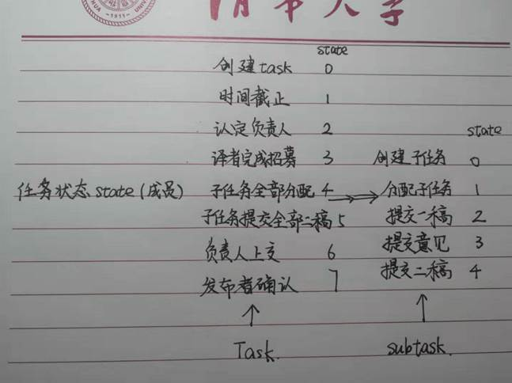
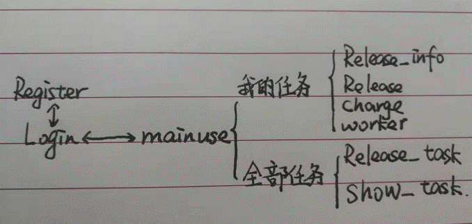

 

#  众包协作翻译平台

<center>
    姓名:陶乐天    日期：2019/8/3   
</center>

  

 

[toc]

## 1平台功能设计

### 1.1总体功能描述

平台的不同功能主要满足不同对象。因此可以根据不同对象对功能分类。

0.  全体用户user：充值、提现、修改密码。

1.    发布者release：发布任务、任命负责人、获取最终译文。

2.    负责人charge：任命译者、布置子任务、提一审意见、提交最终译文。

3.    译者worker：提交一稿、提交二稿。

### 1.2功能流程描述

## 

根据task类的成员state的值的改变跟踪任务状态。中间子任务流程用subtask的state表示。


## 2平台结构设计

这是进行复杂软件开发的第二步，即概要设计。此部分需要说清楚整个软件系统包含哪些模块（或功能部件），模块之间的关系和是怎样的；包含哪些主要的类，类之间的关系是怎样的（可以用UML类图或对象图表达）。

（此部分的子标题和结构自行拟定。）

### 2.1界面现实类：

Register：注册界面

Login:登录界面

Mainuse：用户主操作界面

Release_task：任务发布界面

Show_task：角色申请/任务展示界面

Release_info：任务信息展示界面

Release：发布者界面

Charge：负责人界面

Worker：译者界面

Show_sub：子任务分配界面

### 2.2数据存储类

User：用户

Task：任务

Subtask：子任务（任务的一个成员vector）

### 2.3各界面的关系



 

 

## 3平台详细设计

### 3.1 类结构设计

描述类的结构，即各个类的属性和方法以及设计思路。

1.设计总方针：先有需求再进行设计。

2.总方针解释：不同类的成员在建造前有个初步构想，但难以一应俱全。所以很多成员需要在后续操作流程中体现。

3.具体设计

User用户：

基本信息id、username、pwd、point、qualification、balance

储存任务release、charge、charge_state、worker、worker_state（以上vector）

```
实现函数search_charge、search_worker（返回具体任务在vector中的位置）
 
Task任务：
基本信息id、bookname、introduction、content、recontent、deadline、salary、state、release
存储用户 wait_charge、charge、wait_worker、worker（vector）、subtask（类）
实现函数 search_worker（返回对应人物在vector中的位置）
 
Subtask子任务
基本信息：content、first、comment、second、state
```

 

### 3.2 数据库/文件结构设计

将user用vector构成一个包含user链的类userlist，在main函数中userlist实例化，user的id就是该用户在userlist中的位置。只要储存userlist对象就能存储所有user的信息。
task同理构造一个tasklist。

### 3.3 界面结构设计

界面结构

  显示内部信息的窗口、输入信息的窗口、启动按钮

界面转跳

​    全部采用按钮的槽函数click()实现，出来一开始的登录按钮外，其他界面均采用click后关闭原界面，新界面退出后显示原界面。这样做的目的是方便更新信息。

### 3.4 关键设计思路

​    容错设计

```
       在槽函数click()中先对条件进行判断，判断结合界面传入的数据和内存中的信息。符合条件执行，否则跳出QMessageBox提示窗。
 
```

运行过程

  我的设计思路是由一遍完整的任务发布到最后收回的流程进行，期间需要在申请负责人译者和查看自己的任务之间切换设计。在每一步相关状态改变的click后改变成员的状态。

 

## 4项目总结

总结设计、开发及调试工作中的问题及解决方法、难点、亮点和心得体会等。

（此部分的子标题和结构自行拟定。）

### 4.1难点

1.  QT设计界面相关函数不熟悉，相关状态难以改变。

2.  在设计任务流程过程中思路有时容易被打乱。

3.  SQlite的语言不熟悉。

### 4.2程序的问题

1.  有些数据和函数冗余。比如可以通过任务查找用户也可以通过查找人。这样双向的信息传递要求我改变任务和用户状态，容易出错；有时访问内存数据有任务和用户两种访问方法，使访问方法不唯一。

2.  界面切换基本需要关闭原界面便于刷新。这样的方式会时新建的界面不在用户之前所在的界面位置（因为有tabwight），在用户使用上造成一定困扰。

3.  因为在user和task中有vector的对象，所以没能将数据以一个很好的方式存储在数据库中。

### 4.3心得体会

1.  认真思考各个对象的关系（个性与共性）能更好发挥面向对象语言的作用。否则不能体现面向对象语言的优势。

2.  我整个大作业完成过程中对新事物（QT、SQlite）接受较慢，提升自学能力是一个我努力的方向。
